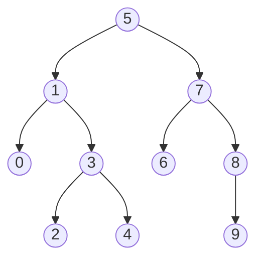

# Binary Search Tree Projesi
[Patika.dev](https://www.patika.dev/)   
 
Root 5'tir.  
Rootun sağında 0,1,2,3,4; solunda 6,7,8,9 bulunur.  
Solda oluşan ilk subtree'de parent 1'dir. Çocuklar, solda 0 ve sağda 3'tür.  
3'ün parent olduğu subtree'de çocuklar, solda 2 ve sağda 4'tür.  
Root'un solunda oluşan ilk subtree'de parent 7'dir. Çocuklar, solda 6 ve sağda 8'dir.  
8'in tek çocuğu 9 ise solunda yer alır.  

