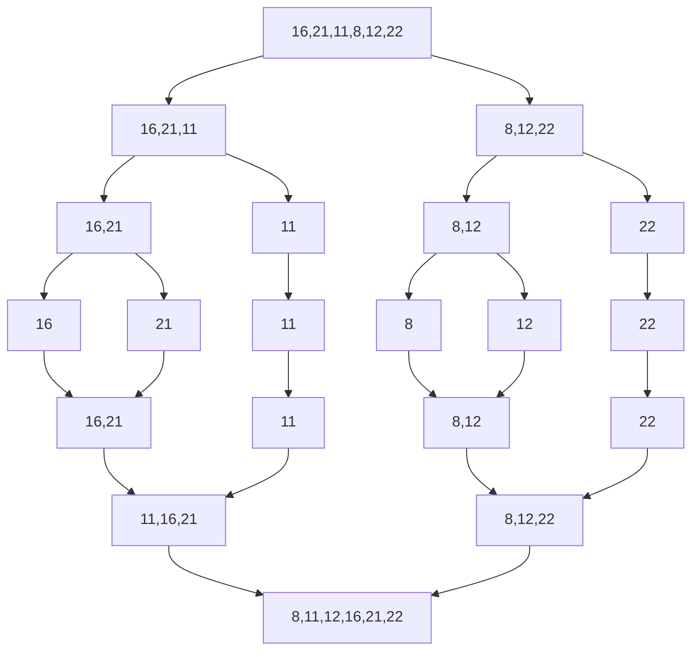

# Merge Sort Projesi- Proje 2

```mermaid
graph TD;
    id1[16,21,11,8,12,22]-->id2[16,21,11];
    id1[16,21,11,8,12,22]-->id3[8,12,22];
    id2[16,21,11]-->id4[16,21];
    id2[16,21,11]-->id5[11];
    id3[8,12,22]-->id6[8,12];
    id3[8,12,22]-->id7[22];
    id4[16,21]-->id8[16];
    id4[16,21]-->id9[21];
    id5[11]-->id10[11];
    id6[8,12]--> id11[8];
    id6[8,12]-->id12[12];
    id7[22]-->id13[22];
    id8[16]-->id14[16,21];
    id9[21]-->id14[16,21];
    id10[11]-->id15[11];
    id11[8]-->id16[8,12];
    id12[12]-->id16[8,12];
    id13[22]-->id17[22];
    id14[16,21]-->id18[11,16,21];
    id15[11]-->id18[11,16,21];
    id16[8,12]-->id19[8,12,22];
    id17[22]-->id19[8,12,22];
    id18[11,16,21]-->id20[8,11,12,16,21,22];
    id19[8,12,22]-->id20[8,11,12,16,21,22];
```
